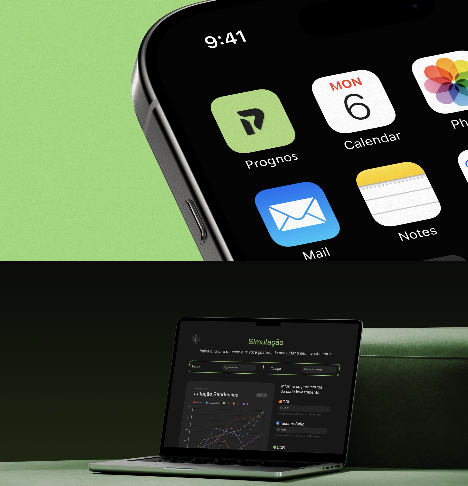
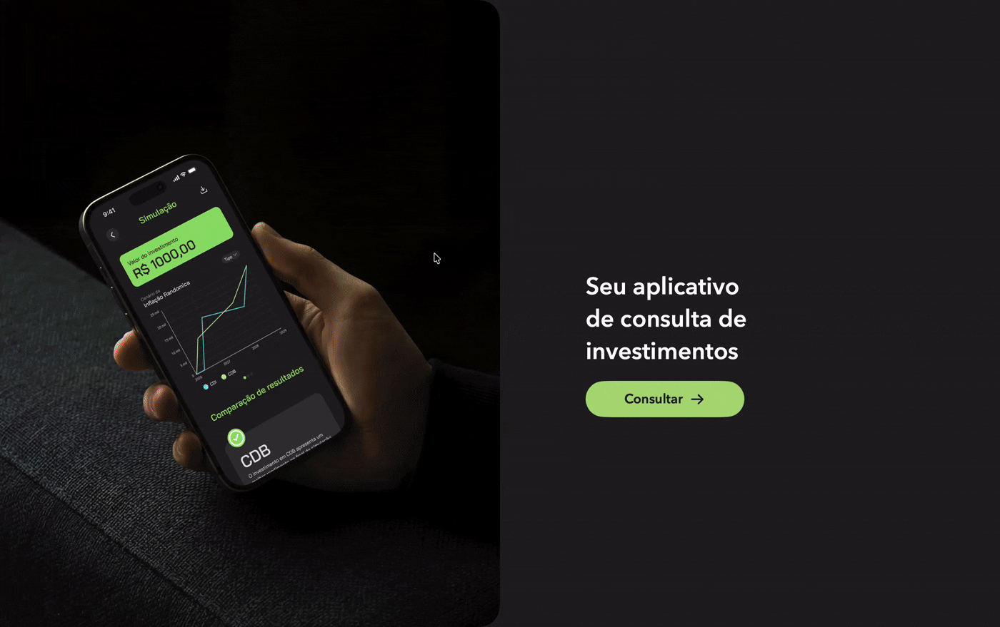
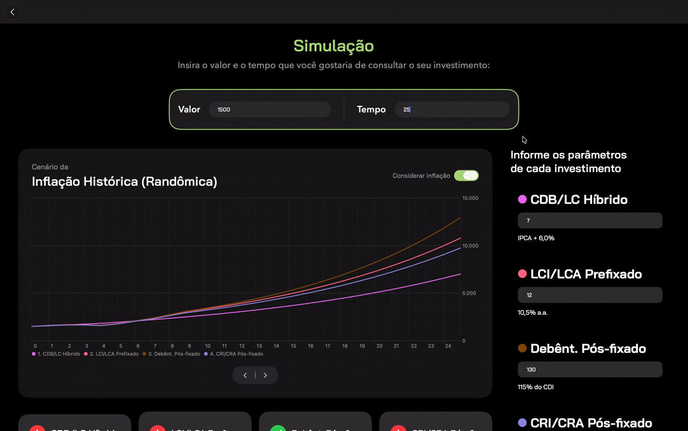
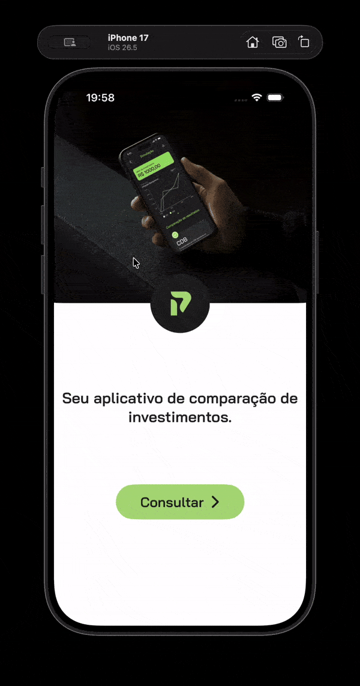
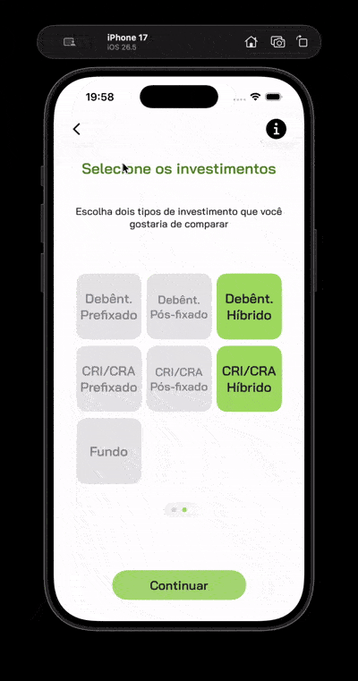

# 📈 Prognos: Investment Simulator and Comparison Tool
Prognos is a smart investment simulator and comparison tool that aims to help users make better investment choices. The program has an easy to use interface for selecting investment categories, entering investment information, and modeling investment results. Prognos allows consumers to see full results, test different investment scenarios and make investment decisions based on data.

## 🚀 Features
- **Investment Selection**: Users are able to compare up to two types of investments.
- **Investment Details**: The user is able to enter details of the investment they choose, such as the amount and the duration.
- **Simulation Results**: The application simulates the results of investment and presents the results in a clear and easy to understand format.
- **Comparison**: Users can compare results of different investment scenarios.
- **Responsive Design**: The application is responsive, so it works well on different devices and screen sizes.

## 🛠️ Tech Stack
- **Frontend**: SwiftUI
- **Backend**: Not applicable (client-side application)
- **Database**: Not applicable (client-side application)
- **AI Tools**: Not applicable
- **Build Tools**: Xcode
- **Frameworks**: Combine, UIKit (for UIPageControl customization)
- **Libraries**: Charts (for creating charts in the results view)

## 📱 System Showcase

<div align="center">
  
</div>

<br>

## 📱 System in Action: Core Flow

Experience the seamless journey from asset selection to the final reactive dashboard, engineered and tailored natively for both platforms.

| 📱 iOS Experience | 💻 macOS Experience |
| :---: | :---: |
|  |  |
| *Mobile-first flow: intuitive asset selection, dynamic state validations, and touch-optimized results.* | *Desktop-first flow: split-screen dashboard, expansive charts, and comprehensive data visualization.* |

### 💻 macOS: Dashboard & Reactive Charts
The macOS interface leverages wider screens to display parameters and results simultaneously. 

<div align="center">
  
  <p><i>The Charts framework reacting smoothly to inflation scenarios and data state changes.</i></p>
</div>

<br>

| Asset Selection & UI States | Search & Accordion Components |
| :---: | :---: |
|  |  |
| *State-driven limits restrict selection to 2 assets, dynamically enabling the Call-to-Action.* | *Real-time search filtering and custom accordion views for educational content.* |

## 📦 Installation
To install and run Prognos, follow these steps:
1. Clone the repository using Git.
2. Open the project in Xcode.
3. Build and run the project using Xcode.

## 💻 Usage
To use Prognos, follow these steps:
1. Launch the application.
2. Select up to two types of investments to compare.
3. Input specific details about your selected investments, such as the amount and duration.
4. Simulate the investment outcomes.
5. View and compare the results of different investment scenarios.

## 📂 Project Structure
```
Prognos
├── Prognos
│   ├── PrognosApp.swift
│   ├── ContentView.swift
│   ├── ViewModel
│   │   ├── InformacaoInvestimentoViewModel.swift
│   │   ├── TelaInvestimentosViewModel.swift
│   │   ├── TelaResultadosViewModel.swift
│   ├── Model
│   │   ├── CardModel.swift
│   │   ├── CenarioInvestimentoModel.swift
│   │   ├── SimulacaoModel.swift
│   ├── View
│   │   ├── TelaSelecaoView.swift
│   │   ├── TelaInformacoesView.swift
│   │   ├── TelaInvestimentosView.swift
│   │   ├── HomeView.swift
│   │   ├── TelaSimuladorView.swift
│   │   ├── TelaResultadosView.swift
```

<!--(* ## 📸 Screenshots  *) -->


## 🍎 Thank you, Apple Developer Academy teammates!
This project was developed in collaboration with @Leo-gsilva, @marifracarolis2-arch, and @naaclaraa. Without you, guys, this wouldn't have been possible! ❤️
